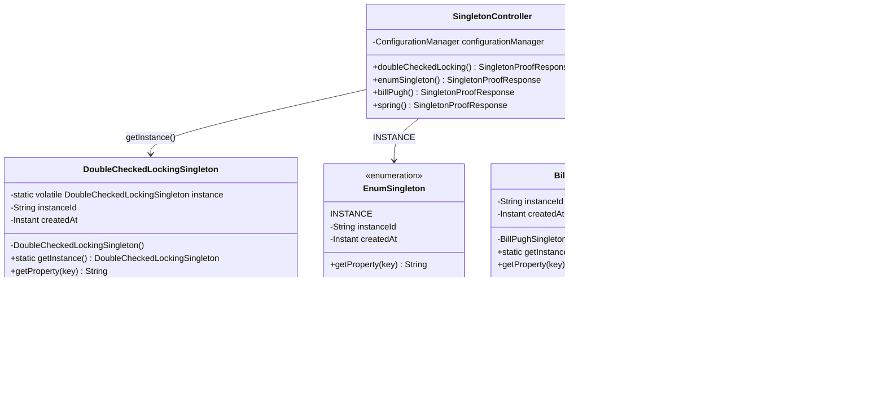
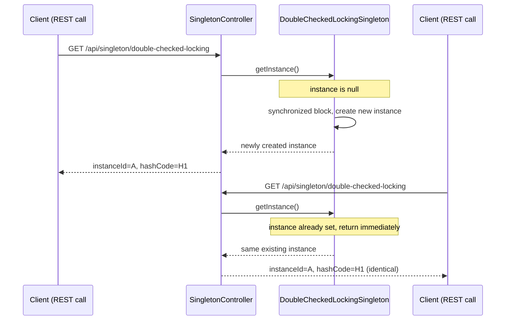

# design-patterns

A single Java 25 + Spring Boot 3 Gradle project for design pattern demos.
Pattern *categories* (Creational, Behavioral, Structural) are Java packages,
not separate folders or separate Gradle projects — this keeps everything on
one build, one dependency set, and one running application.

Currently implemented: **Singleton** (Creational), with four different
implementation strategies exposed over REST so their behavior can be
compared side by side, wrapped around a realistic `ConfigurationManager`
use case.

## Project layout

```
design-patterns/
├── build.gradle
├── settings.gradle
├── gradlew
├── gradlew.bat
├── gradle/wrapper/gradle-wrapper.properties
├── gradle/wrapper/gradle-wrapper.jar
├── singleton-demo.postman_collection.json
├── README.md
└── src/
    ├── main/java/com/example/designpatterns/
    │   ├── DesignPatternsApplication.java     # single @SpringBootApplication entry point
    │   ├── creational/
    │   │   └── singleton/
    │   │       ├── DoubleCheckedLockingSingleton.java  # classic thread-safe singleton
    │   │       ├── EnumSingleton.java                  # Effective Java recommended approach
    │   │       ├── BillPughSingleton.java              # static inner class holder idiom
    │   │       ├── ConfigurationManager.java           # @Component, Spring-managed singleton
    │   │       └── SingletonController.java            # REST endpoints for all 4 variants
    │   ├── behavioral/
    │   │   └── package-info.java              # empty; future patterns land here
    │   └── structural/
    │       └── package-info.java              # empty; future patterns land here
    └── test/java/com/example/designpatterns/creational/singleton/
        ├── ManualSingletonThreadSafetyTest.java   # multithreaded, manual singleton
        └── SpringSingletonBeanTest.java           # Spring bean referential equality
```

**How future patterns get added:** when Factory, Observer, Adapter, etc. are
implemented, they become new classes (and, if needed, new subpackages) inside
the existing `com.example.designpatterns.behavioral` and
`com.example.designpatterns.structural` packages — never new Gradle projects
or new top-level folders. The whole repository stays one buildable,
runnable, testable Spring Boot application.

## Running it

```bash
./gradlew bootRun
```

The app starts on `http://localhost:8080`. Each endpoint returns the variant
name, the singleton's `instanceId` (a UUID assigned once, at construction),
its JVM `instanceHashCode` (via `System.identityHashCode`), its `createdAt`
timestamp, and a sample config value — call any endpoint repeatedly and every
field stays identical, proving the same instance is reused:

| Endpoint                                     | Implementation                          |
|-----------------------------------------------|------------------------------------------|
| `GET /api/singleton/double-checked-locking`   | Double-checked locking + `volatile`      |
| `GET /api/singleton/enum`                     | Enum singleton                           |
| `GET /api/singleton/bill-pugh`                | Static inner class holder (Bill Pugh)    |
| `GET /api/singleton/spring`                   | Spring-managed `@Component` bean         |

Run the tests with:

```bash
./gradlew test
```

## Verifying with Postman

Import `singleton-demo.postman_collection.json` into Postman (or Newman).
It defines a collection variable `baseUrl` (default `http://localhost:8080`)
and a **"Singleton Verification"** folder with two requests per endpoint —
the first call stores `instanceId:instanceHashCode` into a collection
variable, and the second call asserts (`pm.test`) that the value is
identical. With the app running via `./gradlew bootRun`, run the whole
folder (or the whole collection) via the Collection Runner, or with Newman:

```bash
newman run singleton-demo.postman_collection.json
```

All 16 assertions (2 per request × 8 requests) should pass.

## What problem does Singleton solve?

Singleton ensures a class has **exactly one instance** and provides a single,
well-known access point to it. It's useful when a piece of state or a
resource is inherently shared and expensive/incoherent to duplicate — a
configuration registry, a connection pool, a cache, a logging sink — and
having two independent copies would mean two sources of truth or two
competing handles to the same external resource.

**Use it when:**
- Exactly one instance genuinely makes sense for the process's lifetime.
- Global access to that instance is needed, and passing it explicitly
  everywhere would be unreasonably invasive.

**Avoid it when:**
- You just want to avoid passing a dependency around — that's what
  dependency injection is for (see below).
- You need per-request, per-thread, or per-tenant state — a Singleton makes
  that state global and shared, which becomes a hidden coupling and a
  concurrency hazard.
- You need to unit test in isolation — global mutable state is hard to reset
  between tests and hard to substitute with a mock.

## Trade-offs across the four implementations

| Aspect | Double-checked locking | Enum | Bill Pugh (holder) | Spring-managed |
|---|---|---|---|---|
| **Initialization** | Lazy (created on first `getInstance()`) | Eager, at enum class load | Lazy (holder class loads on first access) | Lazy or eager depending on scope/`@Lazy`; container-controlled |
| **Thread-safety mechanism** | Explicit: `volatile` + `synchronized` block | Implicit: JVM guarantees atomic, one-time class init | Implicit: JLS guarantees thread-safe class initialization | Container-managed; scope/bean lifecycle handled by Spring |
| **Thread-safety cost** | Small (one `volatile` read on the fast path after warm-up) | None at call time | None at call time | None at call time (resolved once, cached in the context) |
| **Reflection breakage** | Guarded — the constructor throws `IllegalStateException` if an instance already exists, so a `Constructor.setAccessible(true)` call fails instead of silently creating a second instance | Immune — the JVM forbids reflective enum instantiation | Guarded — same `instanceCreated` check, since there's no `instance` field on the outer class to inspect | Not applicable — Spring doesn't hide the constructor, so reflection isn't "breaking" anything; it can just make more beans if you ask it to |
| **Serialization breakage** | Guarded — implements `Serializable` with `readResolve()`, so deserializing a captured byte stream returns the existing instance instead of a new one | Immune — enum serialization is handled specially by the JVM (writes only the name) | Guarded — same `readResolve()` pattern | Not typically serialized directly; irrelevant to bean identity |
| **Testability** | Poor — static state persists across tests in the same JVM; hard to reset/mock | Poor — same static-state problem, plus can't be subclassed or easily faked | Poor — same static-state problem as double-checked locking | Good — Spring Test can swap the bean via `@MockBean`/test configuration, or spin up a fresh `ApplicationContext` per test class |

### Hardening the manual singletons

`DoubleCheckedLockingSingleton` and `BillPughSingleton` both guard against
the two classic ways to defeat a hand-rolled singleton:

- **Reflection** — `Constructor.setAccessible(true)` lets code outside the
  class call a private constructor directly. Both constructors check for an
  existing instance (`instance != null` for the double-checked variant, a
  dedicated `instanceCreated` flag for the holder variant, since it has no
  `instance` field on the outer class to check) and throw
  `IllegalStateException` on a second call, so reflective construction fails
  loudly instead of quietly producing a second instance.
- **Serialization** — by default, Java deserialization allocates a new
  object without invoking any constructor, bypassing the reflection guard
  entirely. Both classes implement `Serializable` and add a private
  `readResolve()` that returns `getInstance()`, so the deserialization
  machinery discards the object it just allocated and substitutes the real
  singleton.

`EnumSingleton` needs neither: the JVM enforces both guarantees for enums
natively. `SpringConfigurationManager`/`ConfigurationManager` needs neither
either, but for a different reason — cardinality is enforced by the
container, not by hiding the constructor, so there's nothing for reflection
or serialization to defeat. `SingletonHardeningTest` exercises both guards
on both manual singletons.

## Why Spring often makes the classic GoF Singleton unnecessary

Spring beans are **singleton-scoped by default**: for any given
`ApplicationContext`, the container creates one instance of a bean and hands
out that same reference to every injection point (`@Autowired` field,
constructor parameter, `getBean()` call). You get:

- Thread-safe, lazy-or-eager (configurable) instantiation for free — no
  hand-written `synchronized`/`volatile` code to get right.
- Testability — swap the bean for a test double via `@MockBean`, a test
  `@Configuration`, or a differently-scoped context, without touching the
  production class.
- No serialization/reflection loopholes to guard against, because nothing
  about the class itself claims "there can only be one" — the *container*
  enforces the cardinality, not the class.

This is why, inside a Spring application, the idiomatic way to get
Singleton-like behavior is simply `@Component`/`@Service` and constructor
injection — as demonstrated by `ConfigurationManager` here — rather than
hand-rolling `getInstance()`.

**When you'd still hand-roll a classic/enum/holder singleton even in a
Spring app:**
- The class needs to be a true JVM-wide singleton usable *outside* any
  Spring context — e.g. in a static utility, a Java agent, a non-Spring
  library, or code that must work before the `ApplicationContext` exists.
- You need the guarantee to hold across **multiple** `ApplicationContext`s
  in the same JVM (parent/child contexts, multi-module tests) where Spring's
  "one instance per context" guarantee isn't strong enough.
- You're protecting against adversarial reflection/deserialization and want
  the strongest guarantee the JVM offers — this is exactly what the
  Enum Singleton is for.

## Diagrams

### Class diagram



### Sequence diagram (lazy variants: double-checked locking / Bill Pugh)



## Notes on the manual singletons and Spring

`DoubleCheckedLockingSingleton`, `EnumSingleton`, and `BillPughSingleton` are
deliberately **not** Spring beans — they manage their own instance the
classic way, independent of any `ApplicationContext`, so the demo can
contrast them directly against `ConfigurationManager`, which relies entirely
on the container's default singleton scope.
