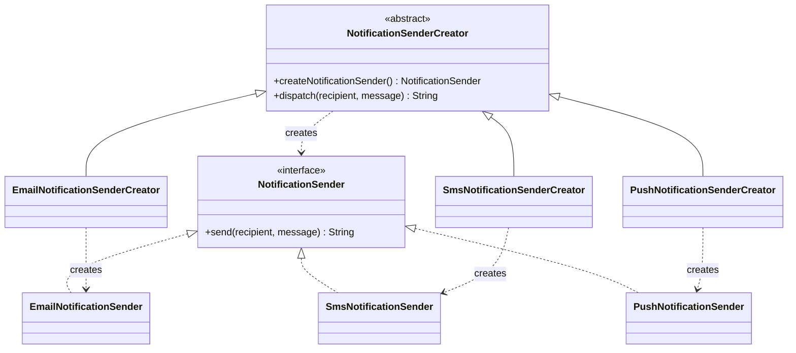
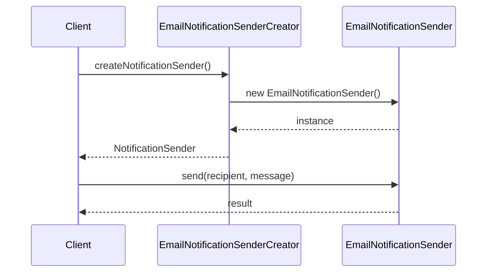

# Factory Method

A notification-dispatch system where the concrete `NotificationSender` is
chosen at runtime based on a "channel" string, demonstrated two ways:
the classic GoF Factory Method (a hierarchy of Creator subclasses) and
Spring's registry-based alternative (`Map<String, NotificationSender>`
injection).

Part of the [design-patterns](../../../../../../../../README.md) project —
see the root README for how to build and run the whole application.

## Files in this package

| File | Role |
|---|---|
| `NotificationSender.java` | Product interface |
| `EmailNotificationSender.java`, `SmsNotificationSender.java`, `PushNotificationSender.java` | Concrete Products — also `@Component`-registered Spring beans |
| `NotificationSenderCreator.java` | Abstract Creator, declares the factory method |
| `EmailNotificationSenderCreator.java`, `SmsNotificationSenderCreator.java`, `PushNotificationSenderCreator.java` | Concrete Creators (classic GoF side) |
| `NotificationSenderFactoryConfig.java` | `@Configuration` wiring the injected `Map<String, NotificationSender>` |
| `NotificationSenderRegistry.java` | Wraps that map with a fail-loud `resolve(channel)` lookup (Spring side) |
| `NotificationController.java` | REST endpoint dispatching via the classic factory method |

## Running it

```bash
./gradlew bootRun
```

```bash
curl -X POST http://localhost:8080/notifications/email/send \
  -H "Content-Type: application/json" \
  -d '{"recipient":"user@example.com","message":"hello"}'
```

`channel` is one of `email`, `sms`, `push`. An unknown channel returns
`400 Bad Request` with an error body instead of a server error. The response
identifies the concrete `NotificationSender` implementation that handled the
request (`handledBy`), proving the factory method resolved the correct type.

Run the tests with:

```bash
./gradlew test --tests "com.example.designpatterns.creational.factorymethod.*"
```

- `CreatorFactoryMethodTest` — each concrete `Creator` produces the matching concrete `Product`.
- `SpringNotificationSenderRegistryTest` — the Spring-managed `Map<String, NotificationSender>` resolves the correct bean per channel, and throws `IllegalArgumentException` (not `null`) for an unknown one.

## Verifying with Postman

The project-level `singleton-demo.postman_collection.json` includes a
**"Factory Method Verification"** folder with one request per channel
(`email`, `sms`, `push`) plus one request for an invalid channel. Each
valid-channel request asserts the response's `handledBy` field names the
expected concrete class; the invalid-channel request asserts a `4xx` status.

## What problem does Factory Method solve?

Factory Method lets a class defer *which concrete type to instantiate* to
subclasses, so the code that uses the product (`NotificationSenderCreator.dispatch`)
never has an `if`/`switch` over concrete types baked into it — that decision
lives entirely in which Creator subclass gets used.

### Factory Method vs. Simple Factory vs. Abstract Factory

These three get conflated often enough that it's worth being explicit:

- **Simple Factory** (not a GoF pattern, but a common idiom) is a single
  method — often static — with an `if`/`switch` that picks a concrete
  Product based on a parameter. `NotificationController.resolveCreator()` in
  this demo is actually a Simple Factory: one method, one switch, no
  subclassing. It's simple, but every new channel means editing that method.
- **Factory Method** (this pattern) pushes the decision into a class
  hierarchy: an abstract `Creator` declares the factory method, and each
  concrete `Creator` subclass hardcodes one Product. Adding a channel means
  adding a new `Creator` subclass instead of editing an existing method —
  better for the Open/Closed Principle, at the cost of one class per
  variant. `NotificationSenderCreator` and its three subclasses are the
  actual Factory Method half of this demo.
- **Abstract Factory** is a level up again: a factory whose job is to
  produce a *family* of related products (e.g. an email sender + an email
  template renderer + an email delivery-receipt parser, all matched to one
  provider), not just one product. Nothing in this demo needs it, because
  there's only one product hierarchy (`NotificationSender`), not several
  related ones that must stay consistent with each other.

## Where this shows up in real systems

- **Notification/messaging dispatch** — this demo's own use case: routing
  to an email/SMS/push/Slack sender based on a channel or user preference
  chosen at runtime.
- **Payment processing** — selecting a `PaymentGateway` implementation
  (Stripe, PayPal, a bank's own API) based on the payment method or region,
  without the checkout flow knowing which concrete gateway it's talking to.
- **Document/report exporters** — producing a `PdfExporter`,
  `CsvExporter`, or `XlsxExporter` from one "export" action based on a
  requested format.
- **Parsers/codecs chosen by content type** — an HTTP client or message
  broker picking a `JsonDeserializer` vs `XmlDeserializer` vs
  `ProtobufDeserializer` based on a `Content-Type` header or message
  envelope.
- **UI toolkit widget creation** — classic GoF example: a
  `Dialog.createButton()` factory method where `WindowsDialog` and
  `WebDialog` subclasses each return a platform-appropriate `Button`,
  while the dialog's layout/rendering code only ever talks to `Button`.
- **Driver/client selection by configuration** — a data-access layer that
  builds a `MySqlRepository` vs `PostgresRepository` vs `MongoRepository`
  based on a configured database type, behind one `Repository` interface.

In a Spring app, most of these are better served by the `Map<String, Bean>`
registry approach demonstrated here (`NotificationSenderRegistry`) than by
a Creator subclass hierarchy — see the trade-offs below for when the
classic GoF form still earns its keep even inside Spring.

## When to use it vs. Spring's dependency injection

The GoF Factory Method exists to solve a problem Spring's container mostly
makes moot: **"given a runtime value, get me the matching implementation."**
Spring already knows every `NotificationSender` bean in the context; letting
it collect them into a `Map<String, NotificationSender>` (see
`NotificationSenderFactoryConfig`) and looking up by key is usually less
code, less indirection, and easier to test than a Creator hierarchy.

**Reach for classic Factory Method when:**
- You're not in a DI container at all (a library, a CLI tool, plain Java).
- The "family" of products needs per-variant *behavior* beyond selection —
  e.g. each Creator also needs to customize the construction workflow
  (`dispatch()` here), not just hand back an instance.
- You want the compiler, not a runtime map lookup, to catch a missing
  variant — forgetting a `case` in a `switch` compiles fine; forgetting to
  extend an abstract method doesn't.

**Reach for Spring's map-based registry when:**
- You're already in a Spring application (true for this entire project).
- New variants should be addable by just writing a new `@Component`, with
  zero changes to any dispatch/factory code — which is exactly how adding a
  fifth `NotificationSender` here would work: no `Creator` subclass, no
  `switch` statement, just a new bean with a new name.

## Trade-offs

| | Classic Factory Method (Creator subclasses) | Spring registry (`Map<String, Bean>`) |
|---|---|---|
| **Adding a new variant** | New `Creator` subclass (and, per this demo's controller, a new `switch` case — a Simple Factory wrapping the Factory Methods) | New `@Component` bean; zero other code changes |
| **Class count** | Grows one-for-one with variants — "subclass explosion" once you have many products or need to combine factory hierarchies | Flat — one registry class regardless of how many variants exist |
| **Failure mode for unknown key** | Compile-time, if selection is a `switch`/`if` over an enum; a runtime miss is a bug in that dispatch code | Runtime only — `NotificationSenderRegistry.resolve()` throws `IllegalArgumentException` for anything not registered as a bean |
| **Works outside a container** | Yes — plain Java, no framework needed | No — depends entirely on Spring's `ApplicationContext` |
| **Customizing the creation workflow per variant** | Natural — override methods in the subclass beyond just the factory method | Awkward — the map only hands back a finished bean; per-variant construction logic has to live in `@Bean`/`@PostConstruct` methods instead |

In short: this demo's own `NotificationController` needs a `switch` to pick
a *Creator*, which is itself a small Simple Factory sitting in front of the
real Factory Method hierarchy — a good illustration of why, inside a Spring
app, the registry approach usually wins: it removes that `switch` entirely.

## Diagrams

### Class diagram



### Sequence diagram


